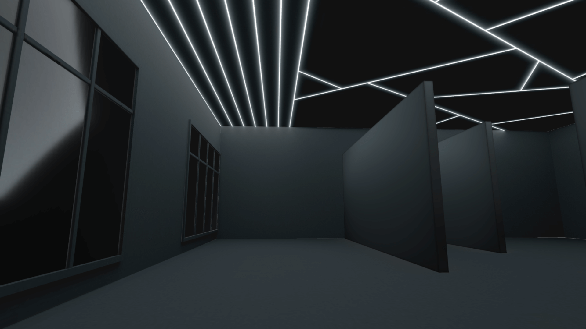
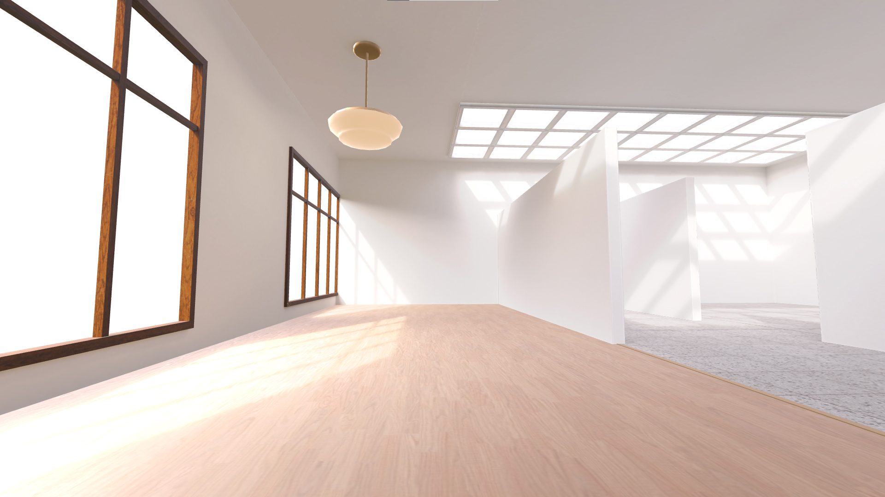
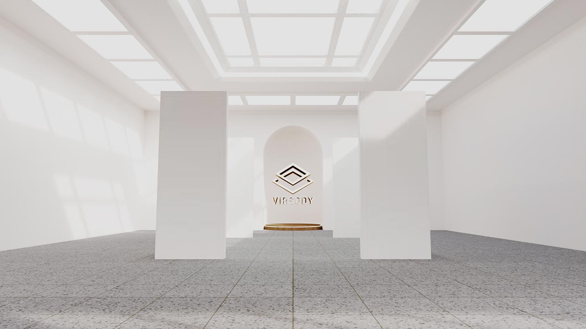

# 創作者方案

創作者方案包含：

* 提供 5 份可編輯的展覽
* 提供 3 份可公開的展覽

以下是創作者方案提供的房型：

1）宇宙 - 款式 A：50 份作品、1 份 2000:1000 主視覺海報、1 個 3D Logo 模型位置

2）宇宙 - 款式 B：40 份作品、1 份 2000:1000 主視覺海報、1 個 3D Logo 模型位置

.jpeg>)

3）優雅 - 款式 A：50 份作品、1 份 2000:1000 主視覺海報、1 個 3D Logo 模型位置

4）優雅 - 款式 B：40 份作品、1 份 2000:1000 主視覺海報、1 個 3D Logo 模型位置

5）霓虹：11 份作品、1 份 2000:1500 主視覺海報、1 個 3D Logo 模型位置

