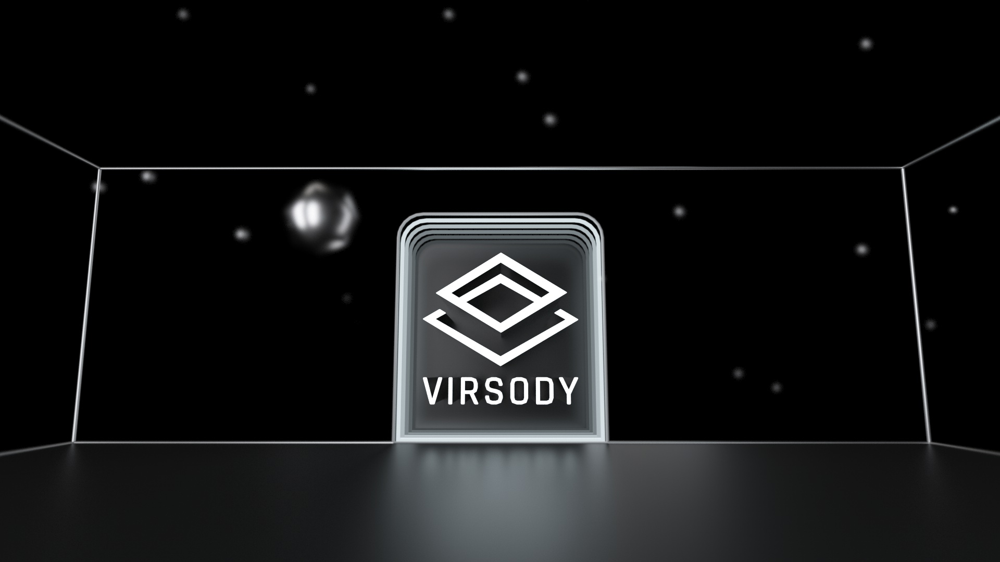
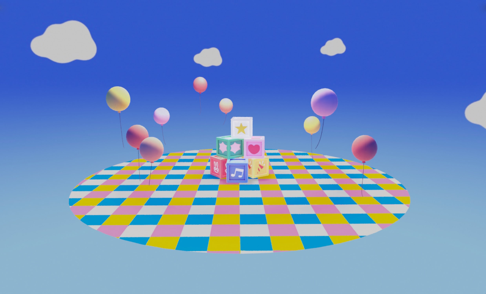

# 基礎方案

基礎方案包含：

* 提供 3 份可編輯的展覽
* 提供 1 份可公開的展覽

以下爲基礎方案提供的房型：

1）經典：11 份作品、1 份 2000:1500 主視覺海報、1 個 3D Logo 模型位置

.jpeg>)

2）經典：11 份作品、1 份 2000:1500 主視覺海報、1 個 3D Logo 模型位置

3）RPF - Cute：40 份作品（作品以環形圍繞着中心）、1 份 1638:1200 主視覺海報

4）RPF - Grass：40 份作品（作品以環形式圍繞着中心）、1 份 1638:1200 主視覺海報

.jpeg>)

&#x20;5）RPF - Moon：40 份作品（作品以環形式圍繞着中心）、1 份 1638:1200 主視覺海報

.jpeg>)

