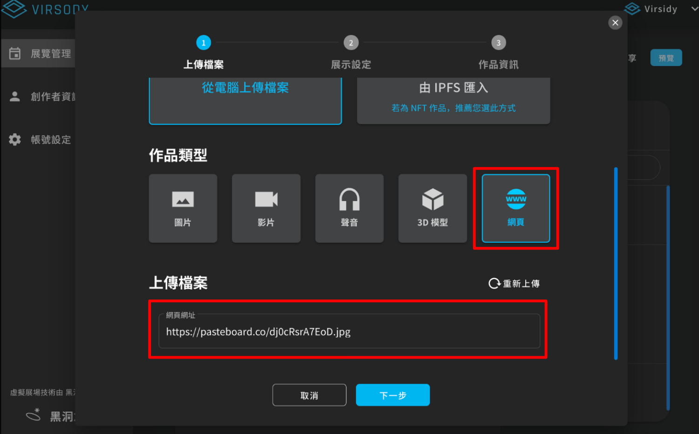

# ⚠️  想上傳的圖片超過 5mb 該怎麼做?

若圖片因各種考量而無法壓縮到 5mb 以下時，您可以參考下列方式來呈現您的原圖給參觀者看:

#### A.使用作品資訊的連結按鈕

把圖片上傳到其他平台（如：圖床、雲端），在作品資訊貼入圖片放置位置的連結，並建議按鈕名稱的命名要具引導性

.png>)

逛展者如想看原圖的話可透過點擊連結按鈕前往。

.png>)

####

#### B.作品類型改用網頁，嵌入圖床連結

使用圖床網站上傳圖片連結，並再上傳作品以「上傳網站」的方式貼入連結，此方法圖片的格式和容量將不受系統所限制。

\* 請注意上傳完後使用預覽檢查嵌入的網頁是否能正常顯示（部分網站不提供嵌入外部網站，會顯示「拒絕連線」）！

以下以免費圖床網站 [Pasteboa](https://pasteboard.co/) 此圖床提供免費方案最大能上傳 10MB 的圖片，並支援 JPEG、PNG、GIF、APNG 、TIFF 等格式。)

Step 1. 此網站免註冊，進入後點擊按鈕上傳圖片

 (1).png>)

Step 2. 再點擊 “Upload” 上傳圖片

.png>)

Step 3. 上傳後，請複製此圖片網址

.png>)

Step 4. 返回 Virsody 的上傳作品系統，點選「網頁」，並將連結貼至欄位中，依照流程完成上傳。

Step 5. 完成以「網頁」形式外嵌上傳大於 5mb 的圖片。

<figure><figcaption></figcaption></figure>

