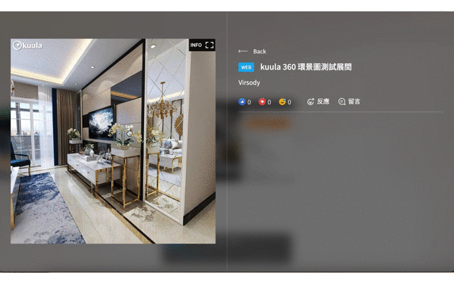

# 1 嵌入 kuula

首先請先進入 [kuula官網](https://kuula.co/about) 進行註冊 / 登入

<figure><figcaption></figcaption></figure>

註冊完後，進入個人頁面點擊「UPLOAD」按鈕

<figure><figcaption></figcaption></figure>

再點擊「SELECT IMAGE ...」按鈕，並上傳想放的 360 環景圖檔案

<figure><figcaption>
 
</figcaption></figure>

上傳完成後，點擊右上角橘色的「POST IT !」按鈕

<figure><figcaption></figcaption></figure>

完成發布後，再點擊「Share」鍵

<figure><figcaption></figcaption></figure>

會出現 Share post 的彈窗，點擊綠色的「GET LINK OR EMBED CODE」按鈕

<figure><figcaption></figcaption></figure>

進入分享連結輸出的編輯頁面，可在右側「Export editor」進行連結分享的其他設定，設定完成後便可複製下方的連結 ( Link )

<figure><figcaption></figcaption></figure>

回到 Virsody，在「上傳網頁」的網址輸入框中貼上剛剛複製的連結，並建立展品

<figure><figcaption></figcaption></figure>

建立完成後，即可讓參觀者在虛擬空間中觀看，並拖曳畫面查看 360 環景圖

<figure><figcaption></figcaption></figure>

