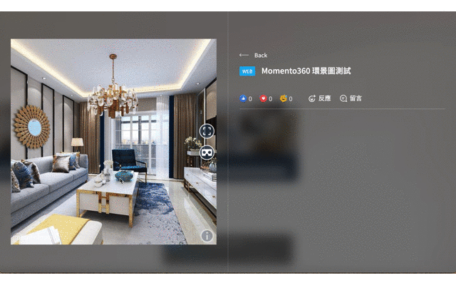

# 2 嵌入 Momento360

首先請先進入[ Momento360官網](https://momento360.com) 進行註冊 / 登入，登入後點擊「MY MEDIA」進入個人後臺

<figure><figcaption></figcaption></figure>

進入後臺，再點擊「UPLOAD」上傳想展示的 360 環景圖

<figure><figcaption></figcaption></figure>

完成後會出現剛上傳圖的圖示，並再次點擊進入編輯頁

<figure><figcaption>
 
</figcaption></figure>

進入該圖後，點擊「分享」 icon 下的「SHARE OR EMBED LINK」按鈕

<figure><figcaption></figcaption></figure>

會出現分享連結的彈窗，繼續點擊「CREATE LINK」

<figure><figcaption></figcaption></figure>

就會出現可複製的分享網址，點擊「COPY」即可成功複製！

<figure><figcaption></figcaption></figure>

再回到 Virsody，在「上傳網頁」的輸入框中貼上剛複製的網址，並完成展品建立

<figure><figcaption></figcaption></figure>

建立完成後，即可讓參觀者在虛擬空間中觀看，並拖曳畫面查看 360 環景圖

<figure><figcaption></figcaption></figure>

