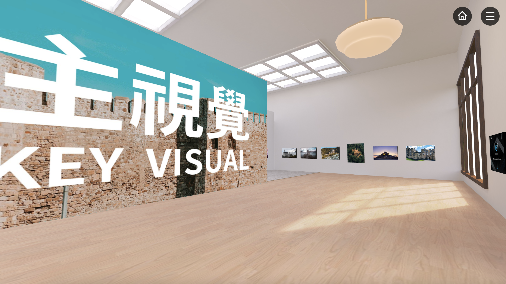

# 上傳主視覺海報

每個主題空間都會提供一面「大牆面」來展示主視覺海報，其通常設置在訪客進入展間的起點附近。

<figure><figcaption></figcaption></figure>

在後臺編輯的空間地圖上，主視覺點位為牆面上的粉紅色「+」點，點擊即可上傳主視覺海報。

<mark style="color:blue;">**備註：主視覺海報的尺寸會依房型有兩種比例：**</mark><mark style="color:blue;"><mark style="color:blue;">**2:1、4:3，即 2000\*1000px 及 2000\*1500px。**<mark style="color:blue;"></mark>

<figure><figcaption></figcaption></figure>

點擊後，會出現上傳彈窗，再點「上傳主視覺海報」按鈕即可上傳主視覺圖檔。

<figure><figcaption></figcaption></figure>

上傳圖片後，可拖曳「裁切框」裁出適合的主視覺海報尺寸。

<figure><figcaption></figcaption></figure>

裁切完成後，記得填寫「主視覺海報名稱」，並點擊「儲存」完成上傳。

<figure><figcaption></figcaption></figure>

上傳完成後，空間地圖上的主視覺點位上，會變成顯示圖片的 Icon ( 代表該點位已上傳成功 )。而當滑鼠移動到主視覺點位上時，則會出現主視覺縮圖以及該名稱。

<figure><figcaption></figcaption></figure>

