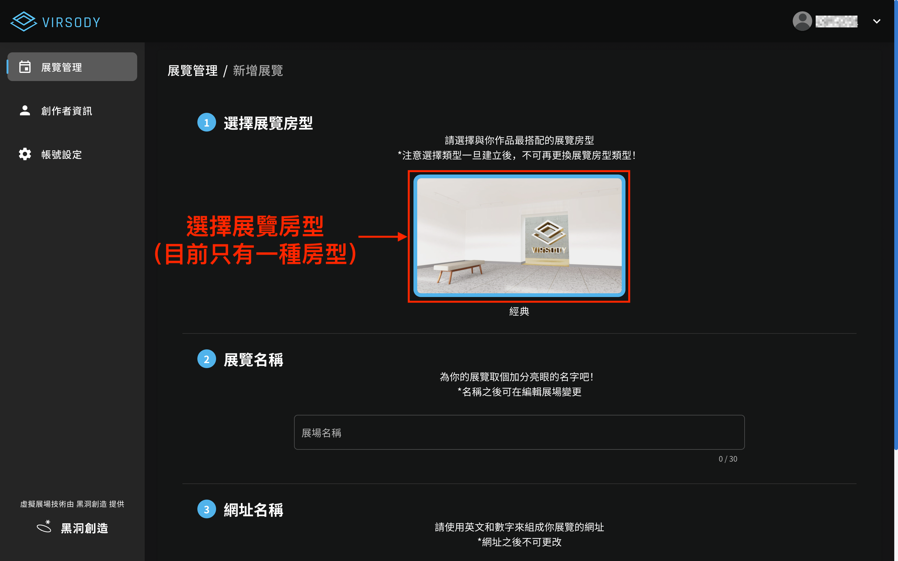
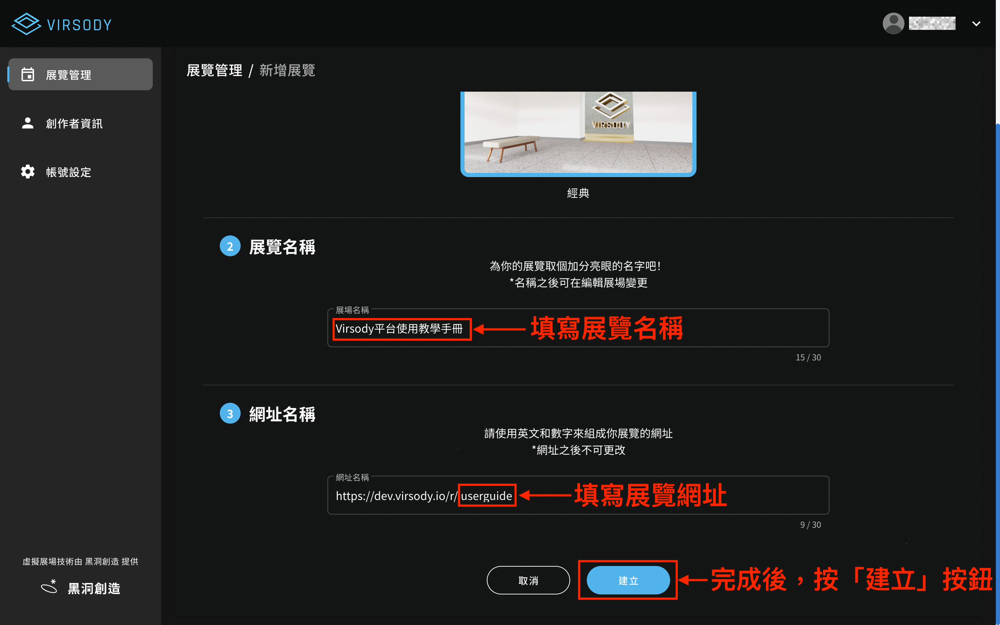

# 新增展覽

進入展場管理後，可點擊「創建展覽」創建新的展覽。

.png>)

接著，你會進入新增展覽頁，請選擇你屬意的「展覽房型」。

<mark style="color:blue;">**備註：不同的方案會有不同的展間房型。**</mark>

接著，請填寫「展覽名稱」及「網址名稱」。

<mark style="color:red;">**注意事項：展間房型和網址名稱在建立後不可更改！**</mark>

這時，你會回到展場管理頁，此時展場管理會多了一個新的展間。

