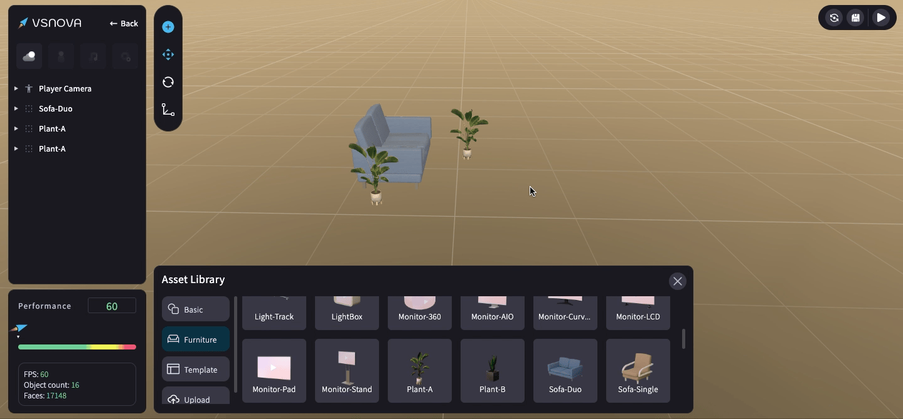

# 場景儲存、預覽、視野回歸原點

場景 (SceneView) 的右上角，有三個功能按鈕：<mark style="color:blue;">**視野回歸原點**</mark>、<mark style="color:blue;">**存檔**</mark>、<mark style="color:blue;">**預覽**</mark>。

<figure><figcaption></figcaption></figure>

<mark style="color:blue;">**1.視野回歸原點 (ResetCamera)**</mark>：點擊後可回歸到場景視野的原點 (0,0,0)

<figure><figcaption></figcaption></figure>

<mark style="color:blue;">**2.存檔 (Save)**</mark>：場景有更動時，右上角的「存檔」按鈕就會出現 <mark style="color:red;">**紅點**</mark> 提示，建議編輯的途中隨時進行存檔！

<figure><figcaption></figcaption></figure>

<mark style="color:blue;">**3.預覽 (Preview)**</mark>：如果你想要查看你所創建的場景的效果，你可以先將檔案存檔，然後點擊「預覽」按鈕，進入預覽模式查看。

<figure><figcaption></figcaption></figure>
