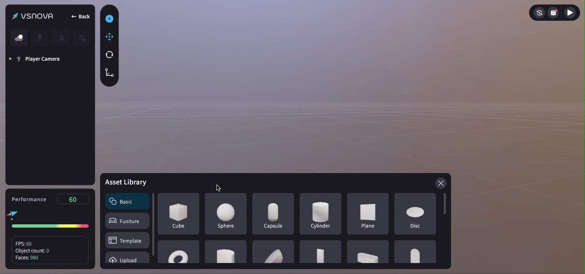

# 素材庫 (Asset Library)

點擊＋號，即可呼叫出素材庫 (Asset Library)。

<figure><figcaption></figcaption></figure>

可用「點擊」或「拖拉」的方式增加 3D 物件到場景中。

<figure><figcaption></figcaption></figure>

素材庫 (Asset Library) 中有提供三種素材類型：

<mark style="color:blue;">**1.基本形狀 (Basic)**</mark>

<figure><figcaption></figcaption></figure>

<mark style="color:blue;">**2.傢具 (Furniture)**</mark>

<figure><figcaption></figcaption></figure>

<mark style="color:blue;">**3.場景模板 (Template)**</mark> ：可利用現成的場景模板再進行客製化的修改！

<figure><figcaption></figcaption></figure>
