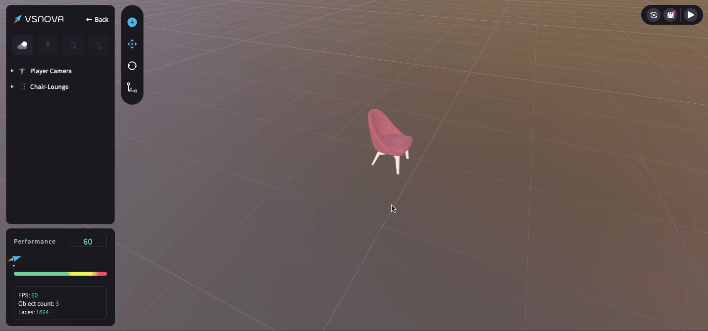

# 物件工具列 (Toolbar)

物件工具列 (Toolbar) 預設為收合的狀態，當點擊選取到 3D 物件時，才會展開。

<figure><figcaption></figcaption></figure>

工具列的主要功能為以下：

<mark style="color:blue;">**1.素材庫 (Asset Library)**</mark>\
提供基本形狀、傢俱、場景模板等的 3D 物件素材，也可以自行上傳模型。

<mark style="color:blue;">**2.移動、旋轉、縮放**</mark>\
可調整 3D 物件的位置、角度_、_尺寸大小。

<mark style="color:blue;">**3.水平 / 垂直翻轉**</mark>\
可調整 3D 物件的水平、垂直翻轉。

<mark style="color:blue;">**4.上鎖、隱藏、刪除、瞄準**</mark>\
可針對 3D 物件進行上鎖、隱藏、刪除、瞄準等動作。

<figure><figcaption></figcaption></figure>

