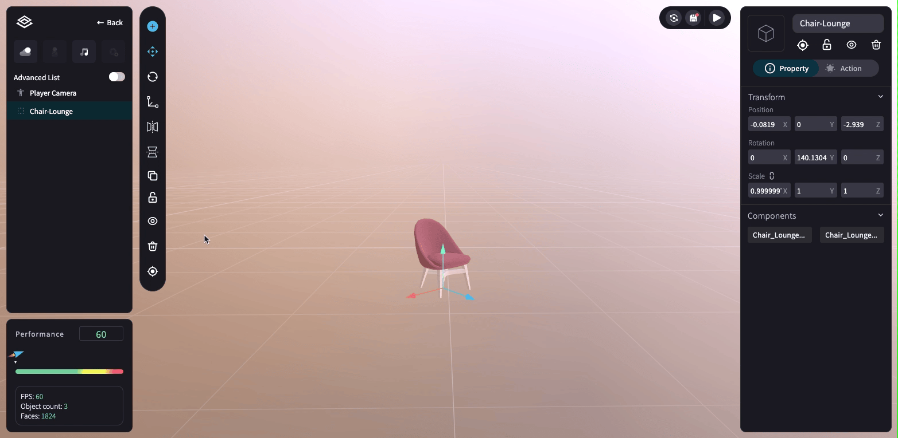

# 物件複製、上鎖、隱藏、刪除、瞄準

在物件工具欄 (Toolbar) 可點擊進行物件 <mark style="color:blue;">**複製、上鎖、隱藏、刪除、瞄準**</mark> 的功能。

<figure><figcaption></figcaption></figure>

<mark style="color:blue;">**1.複製 (Duplicate)**</mark>： 也可使用快捷鍵 → 複製 「ctrl / command + C 」；貼上「ctrl / command + V 」

<figure><figcaption></figcaption></figure>

<mark style="color:blue;">**2.上鎖 (Lock)**</mark>：上鎖後，物件在場景 (SceneView) 上無法被移動、旋轉、縮放。

<figure><figcaption></figcaption></figure>

<mark style="color:blue;">**3.隱藏 (Hide)**</mark>

<figure><figcaption></figcaption></figure>

<mark style="color:blue;">**4.刪除 (Delete)**</mark>：也可使用快捷鍵 「 Delete 」刪除

<figure><figcaption></figcaption></figure>

<mark style="color:blue;">**5.瞄準 (Target)**</mark>：瞄準 3D 物件，將其自動移動到視野中心的位置。

<figure><figcaption></figcaption></figure>
