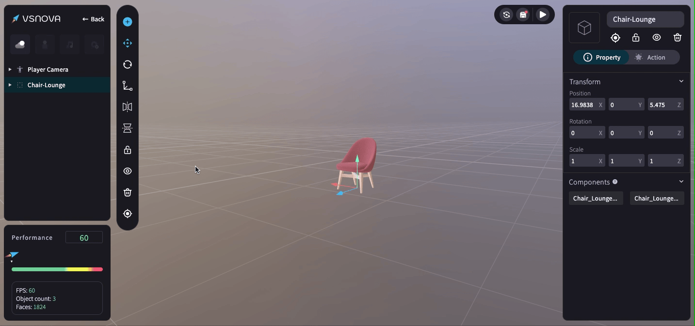
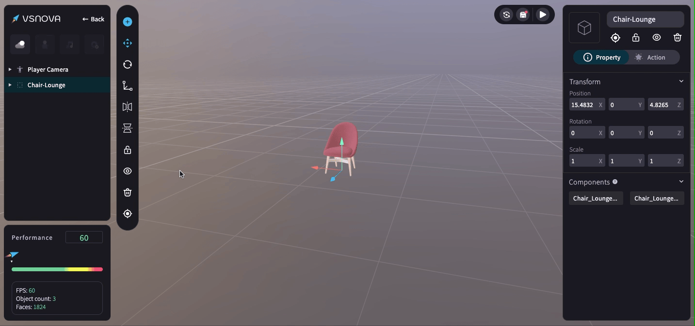
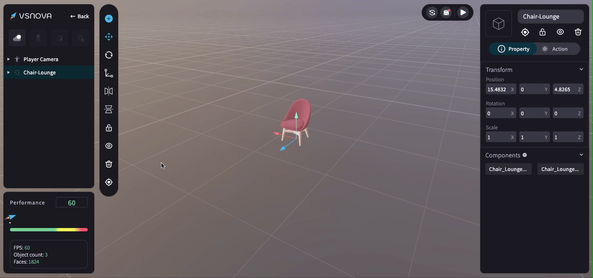

# 物件上鎖、隱藏、刪除、瞄準

在物件工具欄 (ToolBar) 可點擊進行物件 <mark style="color:blue;">**上鎖、隱藏、刪除、瞄準**</mark> 的功能。

<figure><figcaption></figcaption></figure>

<mark style="color:blue;">**1.上鎖 (Lock)**</mark>：上鎖後，物件在場景上無法被移動。

<figure><figcaption></figcaption></figure>

<mark style="color:blue;">**2.隱藏 (Hide)**</mark>

<figure><figcaption></figcaption></figure>

<mark style="color:blue;">**3.刪除 (Delete)**</mark>

<figure><figcaption></figcaption></figure>

<mark style="color:blue;">**4.瞄準 (Target)**</mark>：瞄準 3D 物件，將其自動移動到視野中心的位置。

<figure><figcaption></figcaption></figure>
