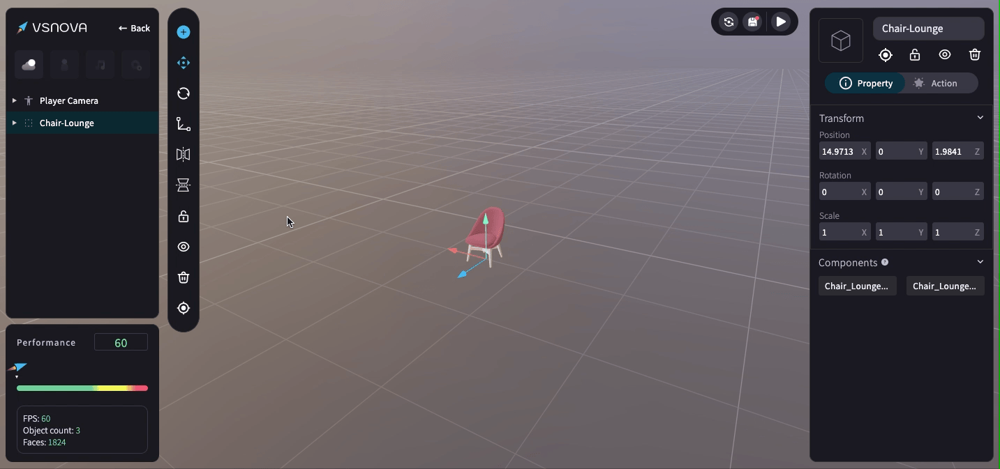

# 物件水平 / 垂直翻轉

在物件工具欄 (Toolbar) 可點擊進行物件 <mark style="color:blue;">**水平 / 垂直翻轉**</mark> 的功能。

<figure><figcaption></figcaption></figure>

<mark style="color:blue;">**物件水平翻轉 / 垂直翻轉**</mark>

<figure><figcaption></figcaption></figure>

