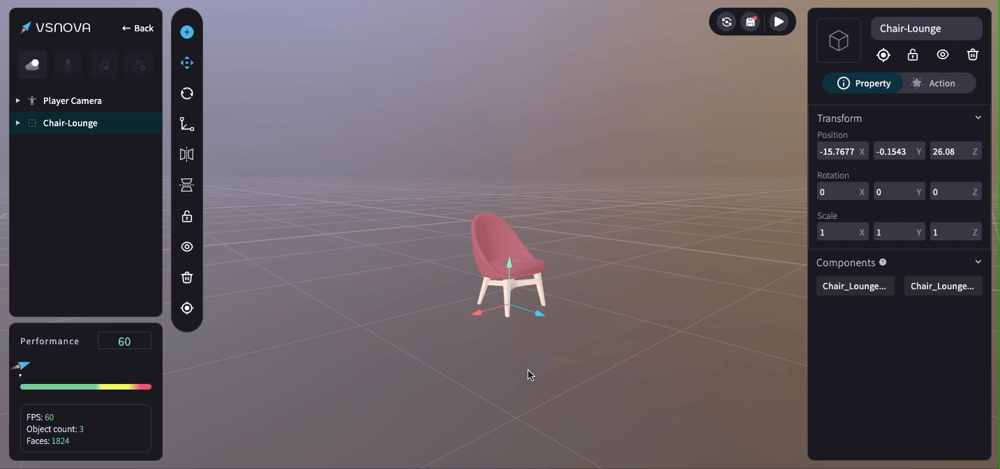
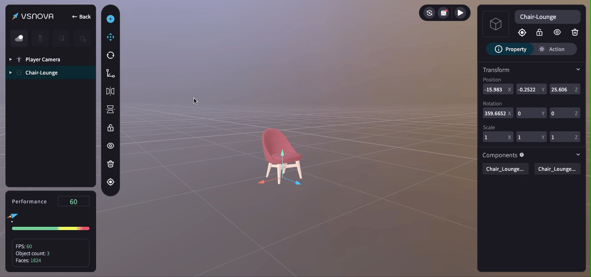
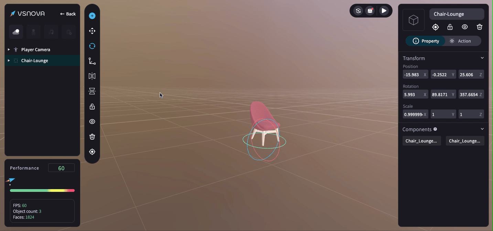

# 物件移動、旋轉、縮放

在物件工具列 (Toolbar) 可點擊進行物件 <mark style="color:blue;">**移動**</mark>**、**<mark style="color:blue;">**旋轉**</mark>**、**<mark style="color:blue;">**縮放**</mark> 的功能 (或者也可以從右側的 Transform 進行相應的數值調整)。

<figure><figcaption></figcaption></figure>

<mark style="color:blue;">**1.三軸移動 (Position)**</mark>

<figure><figcaption></figcaption></figure>

<mark style="color:blue;">**2.三軸旋轉 (Rotation)**</mark>

注意：當 Scale 三軸數值沒有呈現等比時，Rotation 會無法使用場景中的箭頭旋轉，請直接在右側欄位輸入 Rotation 數值。

<figure><figcaption></figcaption></figure>

<mark style="color:blue;">**3.三軸縮放 (Scale)**</mark>

注意：當 Scale 三軸數值沒有呈現等比時，Rotation 會無法使用場景中的三軸工具旋轉，請直接在右側欄位輸入 Rotation 數值。

<figure><figcaption></figcaption></figure>
