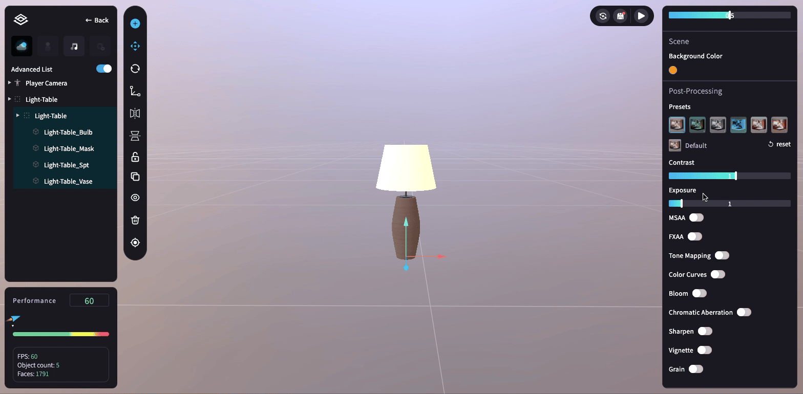
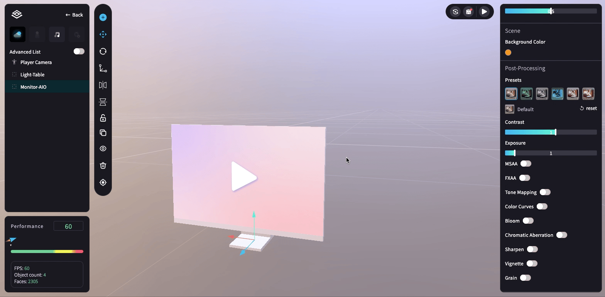

# 💡 環境濾鏡 (Post-processing)

若想讓環境更有氛圍感，可使用 <mark style="color:blue;">**環境濾鏡 (Post-processing)**</mark> 的功能。\
點擊預設的環境濾鏡，下方便會出現該濾鏡的參數，可自由調整！

<figure><figcaption></figcaption></figure>

目前環境濾鏡共有六種風格：Default、Horror、Black & White、Negative、Vintage、Fault

<figure><figcaption></figcaption></figure>

濾鏡可調整的參數共有 10 種，每種參數的調整效果如下：

<figure><figcaption></figcaption></figure>

<mark style="color:blue;">**1.對比度 (Contrast)**</mark>

<figure><figcaption></figcaption></figure>

<mark style="color:blue;">**2.曝光度 (Exposure)**</mark>

<figure><figcaption></figcaption></figure>

<mark style="color:blue;">**3.反鋸齒 (MSAA / FXAA)**</mark>

MSAA 與 FXAA 皆可消除物件邊緣的鋸齒狀，兩者的差別在於：

(1) MSAA：消除邊緣鋸齒的效果強，但較耗效能。\
(2) FXAA：消除邊緣鋸齒的效果弱，但可節省效能。

兩者一起打開時的效果最佳，但若想節省場景的效能 (Performance) ，建議擇一打開即可。

<figure><figcaption></figcaption></figure>

<mark style="color:blue;">**4.色調映射 (Tone Mapping)**</mark>

色調映射 (Tone Mapping) 可將場景調整為一致的平均亮度 (讓太亮的部分暗一些；太暗的部分則亮一些) 。

<figure><figcaption></figcaption></figure>

<mark style="color:blue;">**5.色彩曲線 (Color Curves)**</mark>

開起色彩曲線 (Color Curves) 後，可再細部調整 6 項參數：

1 - 整體色調 (Global Hu)\
2 - 整體飽和度 (Global Saturation)\
3 - 整體密度 (Global Density)\
4 - 高光色調 (Highlights Hue)\
5 - 高光飽和度 (Highlights Saturation)\
6 - 高光密度 (Highlights Density)

<figure><figcaption></figcaption></figure>

<mark style="color:blue;">**6.光暈 (Bloom)**</mark>

開起光暈 (Bloom) 後，可再細部調整 4 項參數：

1 - 模糊半徑 (Kernel)\
2 - 權重 (Weight)\
3 - 閾值 (Threshold)\
4 - 縮放 (Scale)

<figure><figcaption></figcaption></figure>

<mark style="color:blue;">**7.色散 (Chromatic Aberration)**</mark>

開起色散 (Chromatic Aberration) 後，可再細部調整 3 項參數：

1 - 強度 (Amount)\
2 - 徑向強度 (Radial Intensity)\
3 - 方向 (Threshold)

<figure><figcaption></figcaption></figure>

<mark style="color:blue;">**8.銳利化 (Sharpen)**</mark>

開起銳利化 (Sharpen) 後，可再細部調整 2 項參數：

1 - 邊緣強度 (Edge Amount)\
2 - 色彩強度 (Color Amount)

<figure><figcaption></figcaption></figure>

<mark style="color:blue;">**9.暈影 (Vignette)**</mark>

開起暈影 (Vignette) 後，可再細部調整 2 項參數：

1 - 色彩 (Color)\
2 - 權重 (Weight)

<figure><figcaption></figcaption></figure>

<mark style="color:blue;">**10.噪點 (Grain)**</mark>

開起噪點 (Grain) 後，可再細部調整 2 項參數：

1 - 強度 (Intensity)\
2 - 動態 (Animated)

<figure><figcaption></figcaption></figure>
