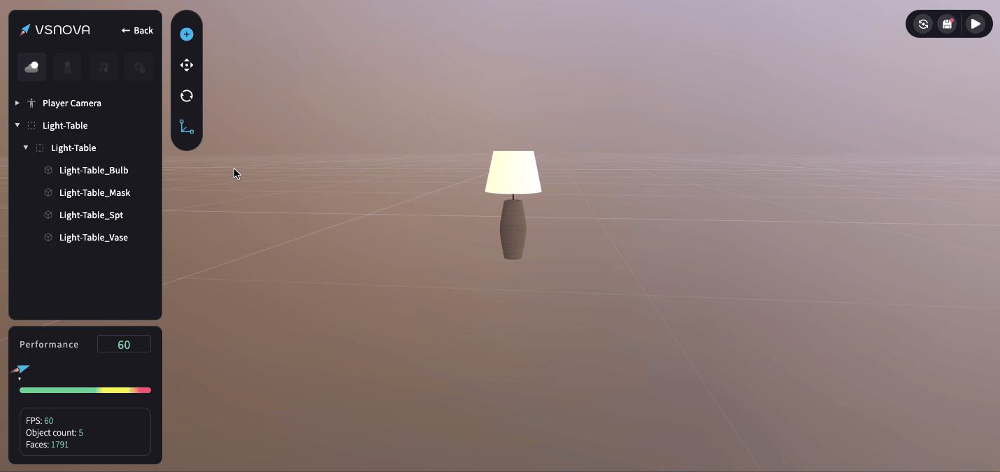
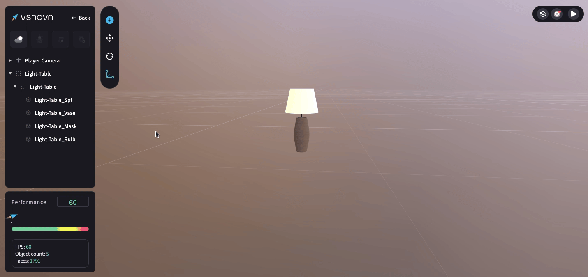

# 物件階層列表

### 物件階層列表中的 3D 物件主要分為兩種：

<mark style="color:blue;">**1.空物件 (Node)**</mark>\
這是用來包含不同 3D 物件的「容器」，本身在場景中是沒有實體型態的。空物件 (Node) 目前無法自行製造，只能在素材庫中的 3D 物件中找到。你可以把其他 3D 物件放入空物件中，並將它們群組在一起。

<mark style="color:blue;">**2.實體物件 (Mesh)**</mark>\
實體的 3D 物件。

<figure><figcaption></figcaption></figure>

###

### 物件階層列表中的父子層級關係（Parent-child）：

<mark style="color:blue;">**1.開啟 詳細階層列表 (Advance List)，才會看到子層**</mark>

物件的詳細階層列表 (Advance List) 預設為「關閉」，僅能可見最上面的「父層級」的物件 。

<figure><figcaption></figcaption></figure>

把詳細階層列表 (Advance List) 打開時，才能看見該父層級底下，屬於「子層級」的其他物件。

<figure><figcaption></figcaption></figure>

<mark style="color:blue;">**2.子層級屬性會跟隨其父層級**</mark>\
\
選擇父層級的空物件 (Node) 並進行狀態改變 (e.g. 縮放、移動、隱藏)，會一起影響到子層級的實體物件 (Mesh)。\
點擊左側三角形可收合或展開父子層級。

<figure><figcaption></figcaption></figure>

<mark style="color:blue;">**3.拖曳物件形成父子層級**</mark>

需點擊收合箭頭，使父子層級展開，才能將物件拖曳至該物件的子層級。\
只有空物件 (Node)可以形成父子層級，實體物件 (Mesh)之間無法形成父子層級。\
注意：無論是空物件 (Node) 還是實體物件 (Mesh) 都可以在階層列表中自由拖移，調整階層或順序。

<figure><figcaption></figcaption></figure>

### 物件控制：

<mark style="color:blue;">**1.重新命名**</mark>

在列表點擊兩下，可重新命名空物件 (Node) 或實體物件 (Mesh)，也可以在右側的物件屬性中重新命名。

<figure><figcaption></figcaption></figure>

<mark style="color:blue;">**2.隱藏與上鎖**</mark>

將滑鼠懸停在列表上，物件名稱旁邊就會出現「隱藏」跟「上鎖」的按鈕，點擊後即可針對該物件進行隱藏或上鎖。

<figure><figcaption></figcaption></figure>

&#x20;<mark style="color:blue;">**3.多選、群組與解除群組**</mark>

按住「control / command+ 滑鼠點擊」物件，可「多選」一個以上的物件

<figure><figcaption></figcaption></figure>

將物件多選起來後，可按住「control / command+ G」 進行「群組」。\
若想要解除群組則可按「shift+command+G」。

<figure><figcaption></figcaption></figure>
