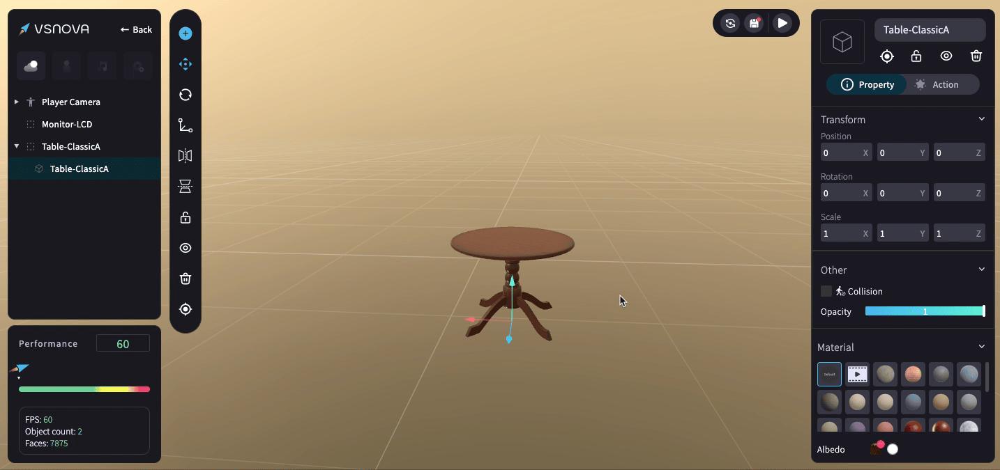

# 物件屬性 (Inspector)

當點擊 3D 物件時，右側便會出現物件屬性 (Inspector) 面板。

除了可以為物件重新命名、瞄準、上鎖、隱藏跟刪除之外，還可進一步為 3D 物件進行<mark style="color:blue;">**屬性(Property)**</mark> 跟 <mark style="color:blue;">**資訊版 (Action)**</mark> 的設定。

<figure><figcaption></figcaption></figure>

<mark style="color:blue;">****</mark>

<mark style="color:blue;">**1.屬性 (Property)**</mark>：設定物件的位置、角度、大小、透明度、碰撞區、材質。

<figure><figcaption></figcaption></figure>

<mark style="color:blue;">**2.資訊版 (Action)**</mark>：設定物件的資訊版，讓 3D 物件被觀賞者點擊時，可呈現詳細內容資訊。

<figure><figcaption></figcaption></figure>
