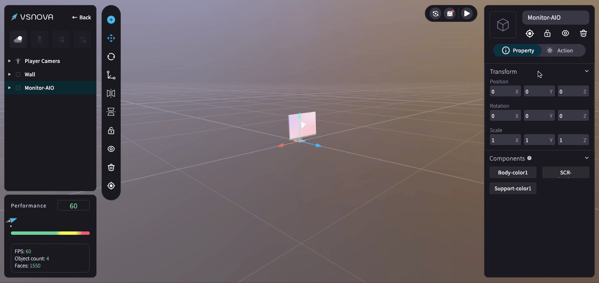
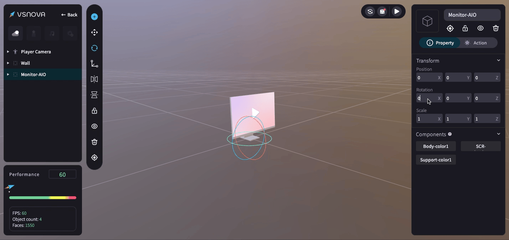
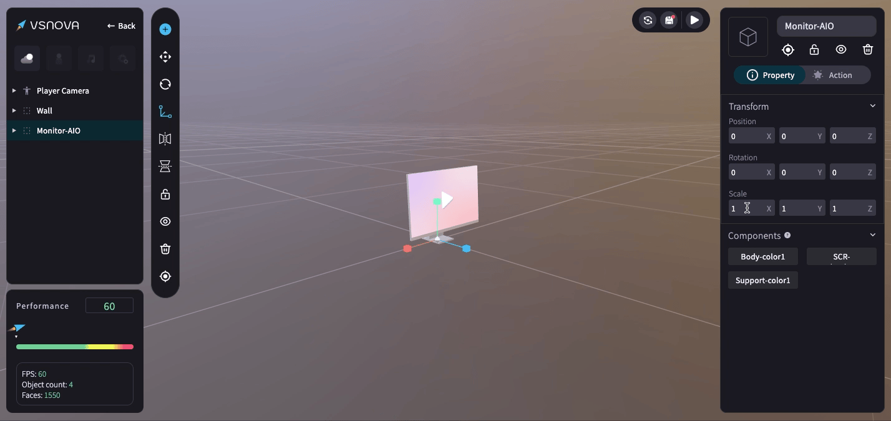

# 💡 物件變形：移動、旋轉、縮放 (Transform)

在物件變形的區域 (Transform) 可進行精準的數值調整，可填入<mark style="color:blue;">**小數點**</mark>、<mark style="color:blue;">**正負數**</mark>等。

<figure><figcaption></figcaption></figure>

<mark style="color:blue;">****</mark>

<mark style="color:blue;">**1.物件移動 (position)**</mark>

<figure><figcaption></figcaption></figure>

<mark style="color:blue;">**2.物件旋轉 (Rotation)**</mark>：旋轉的欄位需填入較大的數值，才能更明顯地顯示 3D 物件的角度差異。

<figure><figcaption></figcaption></figure>

<mark style="color:blue;">**3.物件縮放 (Scale)**</mark>

<figure><figcaption></figcaption></figure>
