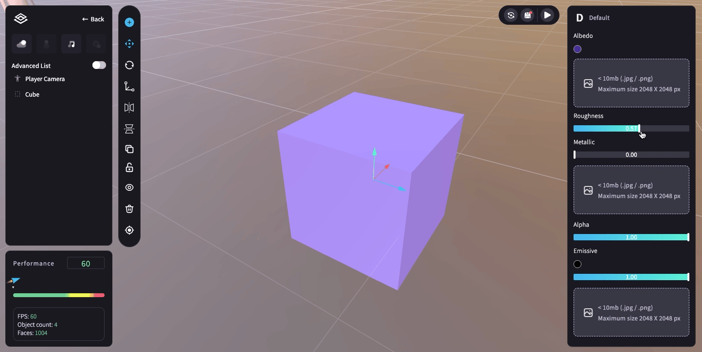
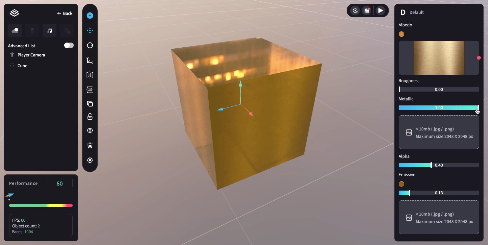
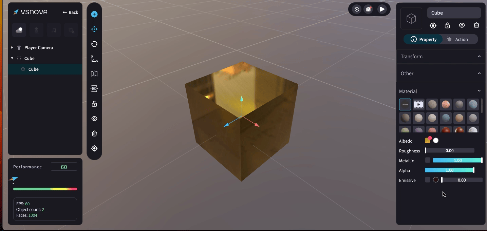

# 💡 物件材質 (Material)

在材質 (Material) 區域可為 3D 物件更換的材質有三種類型：<mark style="color:blue;">**預設值**</mark>、<mark style="color:blue;">**影片**</mark>、<mark style="color:blue;">**材質球**</mark>。

<figure><figcaption></figcaption></figure>

<mark style="color:blue;">**1.預設值 (Default)**</mark>：可自由上傳圖片，並調整預設值的<mark style="color:blue;">**參數**</mark>。

參數共有五種：材質色彩 (Albedo)、粗糙度 (Roughness)、金屬感 (Metallic)、透明度（Alpha）、發光度 (Emissive)

<figure><figcaption></figcaption></figure>

<mark style="background-color:blue;">**(1) 材質色彩 (Albedo)**</mark> ：可換顏色，或上傳圖片作為物件材質。

\-> 可點選「圓圈」的部分，透過<mark style="color:blue;">**調色盤**</mark>調整 3D 物件的顏色。

<figure><figcaption></figcaption></figure>

\-> 或點擊「方框」，上傳<mark style="color:blue;">**圖片**</mark>作為材質 (建議規格：2k以下；僅接受 png. jpg.)，上傳後則會有刪除按鈕可清除上傳的圖片。

⚠️ 注意：若上傳透明背景的 png 檔案，透明部分會呈現黑色。

<figure><figcaption></figcaption></figure>

<mark style="background-color:blue;">**(2) 粗糙度 (Roughness)**</mark> ：數值大 (霧面) -> 數值小 (亮面)。

<figure><figcaption></figcaption></figure>

<mark style="background-color:blue;">**(3) 金屬感 (Metallic)**</mark>：數值大 (金屬感強) -> 數值小 (金屬感弱)。

金屬感 (Metallic) 的參數也可另外上傳圖片 (建議規格：1k以下；png. jpg.)。

<figure><figcaption></figcaption></figure>

<mark style="background-color:blue;">**(4) 透明度 (Alpha)**</mark>：數值大 (不透明) -> 數值小 (透明)。

⚠️ 注意：若完全透明 ( Alpha 數值=0 ) 會呈現黑色。

<figure><figcaption></figcaption></figure>

<mark style="background-color:blue;">**(5) 自體發光 (Emissive)**</mark>：為 3D 物件「發光」的顏色，數值大 (光強) -> 數值小 (光弱)。

自體發光 (Metallic) 的參數也可另外上傳圖片 (建議規格：1k以下；png. jpg.)。

<figure><figcaption></figcaption></figure>

<mark style="color:blue;">**2.影片**</mark>：可上傳影片當作 3D 物件的材質 (影片大小需 < 10mb)，上傳後則可點擊「reset」清除。

<figure><figcaption></figcaption></figure>

<mark style="color:blue;">**3.材質球**</mark>：以自由編輯器中現成的材質球進行更換。

⚠️ 注意：材質球的參數是固定的，無法調整。

<figure><figcaption></figcaption></figure>
